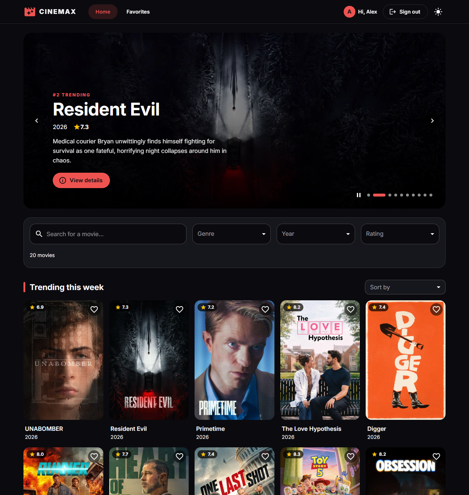
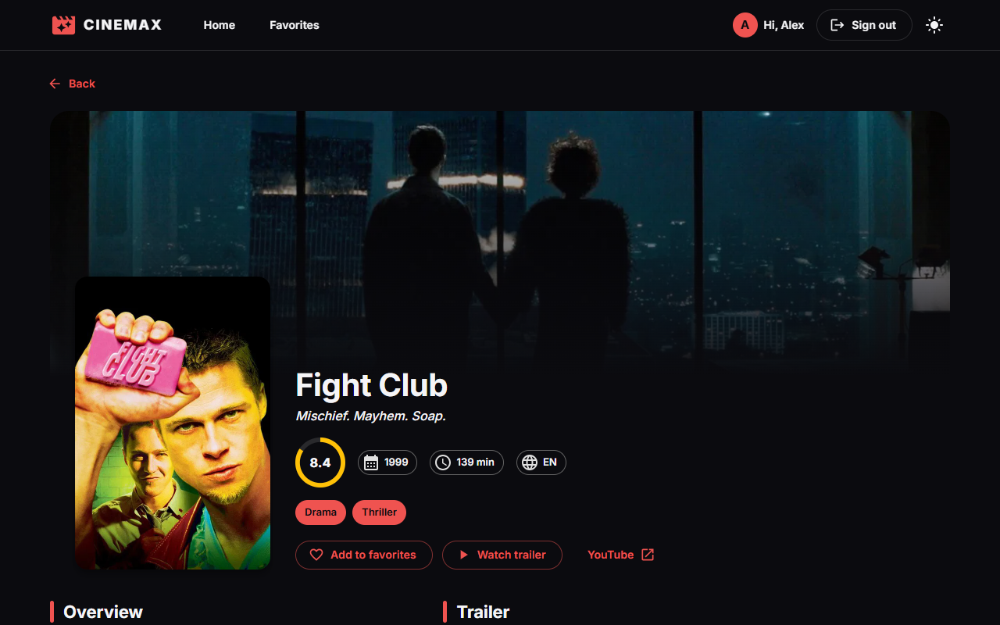
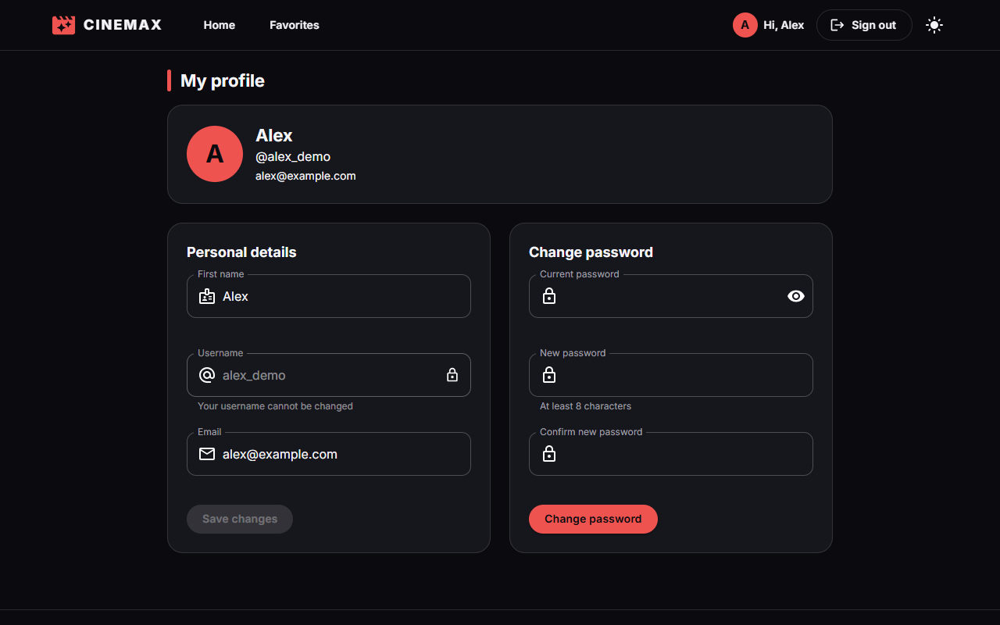
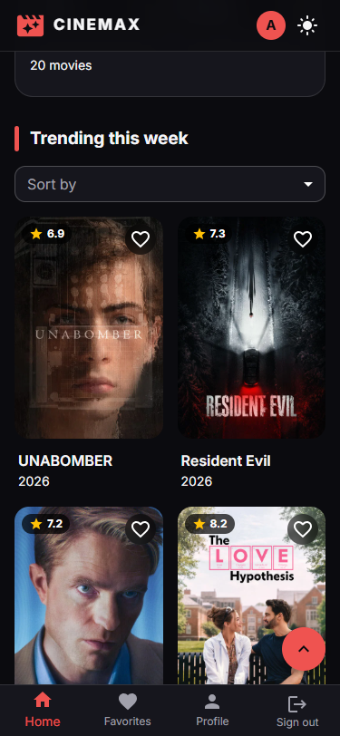

# Cinemax: Movie Explorer

A web app to search for movies, see what is trending, read the details, watch trailers and save favorites.
All movie data comes from the [TMDb API](https://developers.themoviedb.org/3).

**Live demo:** _add the Vercel link here after deploying_



## Features

Required by the brief:

- Login screen (mock login, see [Demo accounts](#demo-accounts)) with protected routes
- Search bar with relevant results, saved as the last search in localStorage
- Movie grid with poster, title, release year and rating
- Movie details: overview, genres, cast, embedded YouTube trailer and a link to YouTube
- Trending movies section (this week, from TMDb)
- Light and dark mode, remembered between visits
- Infinite scroll for search results
- Friendly error messages with a Retry button (timeout, offline, bad key, not found, rate limit, server error)
- Favorites saved in localStorage, with their own page
- React Context API for state
- Mobile-first responsive layout

Bonus and extras:

- Filter by genre, year and rating (asked from TMDb when not searching, so results are complete)
- Load More button for trending and filtered lists
- Sort dropdown (rating, newest, oldest, title)
- Auto sliding banner with the top 10 trending movies
- Sign up page with inline validation and a password strength meter
- Profile page: change first name, email and password (the username cannot be changed)
- Restores the scroll position when you go back
- Error boundary and an offline banner
- Not Found page, favicon and app icons
- Unit tests for the services, hooks and error boundary

## Screenshots

| Movie details | Profile |
|---|---|
|  |  |

| Home on a phone |
|---|
|  |

## Tech stack

- React 19 with Create React App
- MUI (Material-UI) for the UI
- axios for API requests
- React Router for navigation
- Context API for state
- Jest and React Testing Library for tests

## Getting started

You need Node.js and npm.

1. Clone the repository and install the packages:

   ```
   npm install
   ```

2. Get a free TMDb API key: create an account at https://www.themoviedb.org, open
   **Settings > API** and copy the **API Key (v3 auth)**.

3. Copy `.env.example` to a new file called `.env` and put your key in it:

   ```
   REACT_APP_TMDB_KEY=your_tmdb_api_key_here
   ```

4. Start the app (it opens at http://localhost:3000):

   ```
   npm start
   ```

If you change `.env` later, stop and start `npm start` again. The file is only read at startup.

Other commands:

| Command | What it does |
|---|---|
| `npm start` | Runs the app in development mode |
| `npm run build` | Makes the production build in the `build` folder |
| `npm test` | Runs the unit tests |

## Project structure

```
src/
  components/   reusable UI: MovieCard, MovieGrid, SearchBar, FilterBar, MovieDetails, HeroBanner, Navbar ...
  pages/        Login, SignUp, Home, MovieDetails, Favorites, Profile, NotFound
  context/      AppContext (theme, user, favorites) and MovieContext (movies, search, filters, paging)
  services/     tmdb.js (axios), movies.js (API calls), auth.js, validation.js, errorMessage.js
  hooks/        useLocalStorage, useDebounce, useOnlineStatus
  theme.js      MUI light and dark themes
public/         index.html, favicon and app icons
```

## Routes

| Path | Page | Login needed |
|---|---|---|
| `/login` | Login | No |
| `/signup` | Sign up | No |
| `/` | Home (banner, search, filters, trending) | Yes |
| `/movie/:id` | Movie details | Yes |
| `/favorites` | Favorites | Yes |
| `/profile` | Profile | Yes |
| anything else | Not Found | No |

## TMDb API usage

The key is sent as the `api_key` query parameter. Every request goes through one axios instance
(`src/services/tmdb.js`) with a 10 second timeout.

| Endpoint | Used for |
|---|---|
| `/trending/movie/week` | Trending list and the banner |
| `/search/movie` | Search (with `page`, and `primary_release_year` when a year is picked) |
| `/discover/movie` | Filtered lists: `with_genres`, `primary_release_year`, `vote_average.gte` |
| `/movie/{id}?append_to_response=credits,videos` | Details, cast and trailer in one request |
| `/genre/movie/list` | Genre names for the filter |

Posters and backdrops come from `https://image.tmdb.org/t/p/`. The trailer is the first YouTube video of
type "Trailer", shown with `https://www.youtube.com/embed/<key>`.

## State management

Two contexts keep the state:

- `AppContext`: theme mode, the logged in user, and the favorites list
- `MovieContext`: search text, results, filters, sort, paging and the banner movies

What is saved in localStorage:

| Key | Value |
|---|---|
| `themeMode` | `light` or `dark` |
| `user` | The logged in user (no password) |
| `users` | The demo accounts |
| `favorites` | Favorite movies |
| `lastSearch` | The last search text |

Saved values are checked when they are read, so a broken value is ignored instead of crashing the app.

## Demo accounts

There is no server. Sign up creates an account in this browser's localStorage, and the password is saved
as a salted SHA-256 hash. This is enough for the brief's "mock login", but it is **not real security**:
anyone with access to the browser can read or change localStorage. A real app needs a back end.

Login accepts the email or the username together with the password.

## Deploying on Vercel

1. Push the code to a Git repository and import it in Vercel.
2. Under **Environment Variables** add `REACT_APP_TMDB_KEY` with your TMDb key.
3. Deploy. Vercel detects Create React App by itself.

`vercel.json` sends every path to `index.html`, so refreshing a page like `/favorites` works.

The TMDb key is part of the front end code, so anyone can see it in the browser. That is normal for a
front end only project, and TMDb keys are free to replace.

## Testing

```
npm test
```

The tests cover the API calls, the error messages, the login and validation code, the SHA-256 code, the
localStorage, debounce and online hooks, and the error boundary.

## Known limitations

- Accounts and favorites live in one browser only. They are not shared between devices.
- Login is a demo, see [Demo accounts](#demo-accounts).
- Search does not filter by genre or rating on the TMDb side, so those two filters are applied to the
  loaded results while searching.

## Credits

Developed by Riflan Mohamed.

This product uses the TMDB API but is not endorsed or certified by TMDB.
